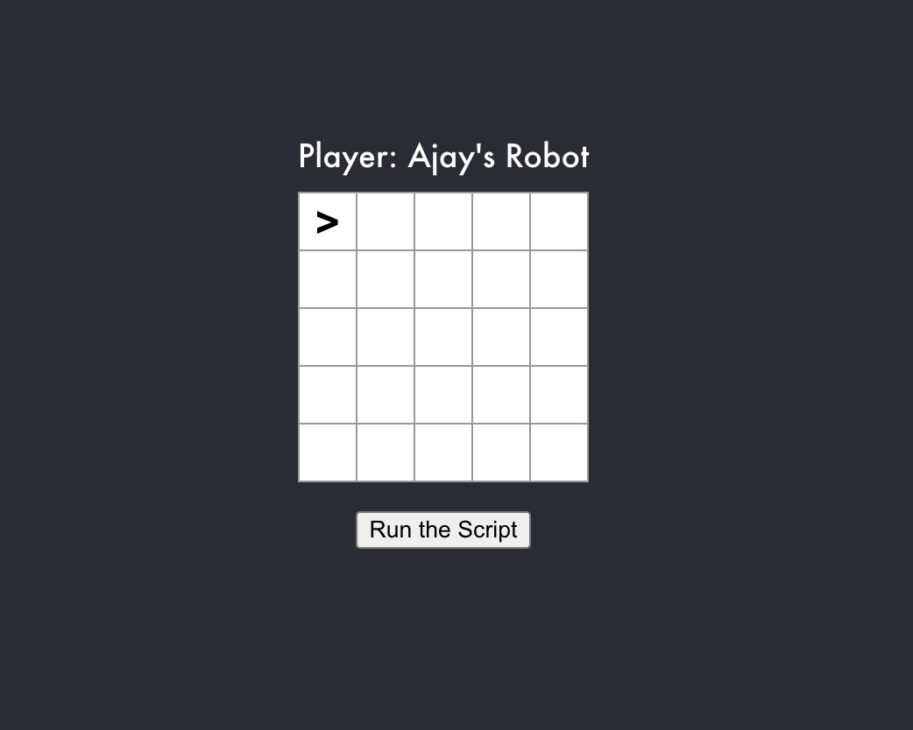
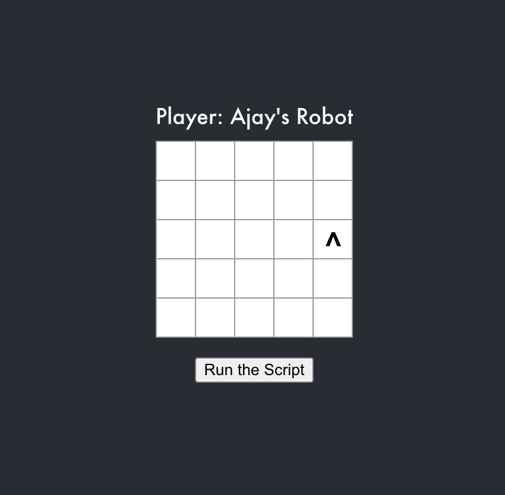

# idealo-code-challenge
Simple environment for a robot where user can control it using this predefined script

- Readme of [backend](backend/README.md).
- Readme of [frontend](frontend/README.md).

## Approach - 
As per requirements a frontend application & backend application were needed and whole task was needs to be completed in 5-6 Hrs

### Server (Spring Boot) (2-3 Hrs)
1. First I worked on backend, tested problem solution with Junit test without much packages.
2. Once it was done, I created two entity (Robot, Position) created relative controller, service, repo classes and followed SOLID principal for responsibility segregation.
3. Then tested code with Spring integration testing and Swagger (Note: Used swagger as well as it doesn't take much time to integrate it with Spring Boot and helped me in testing)
4. Used Lombok which saved good amount of time.

### Frontend (ReactJs) (~2 Hrs)
1. Used commands to create project structure (didn't want to spend much time on project creation) and component, didn't use typescript for simplicity. Which saved my good time.
  - e.g. used create-reactjs-component (Create component file, test, Readme), create-react-app 
2. Then created three component Game, Board, Square.
3. Used Service Class for API call

### Documentation (30 - 45 min)
1. Would like to mention that documentation and readme update also took time :) 

### What could I completed:
1. I was able to create a frontend application with a board, and additional button for submission.
2. I was able to write testcases and test application on browser as well.
3. In backend followed right package standard, created entity driven design
4. I was able to right Unit Testcases for Movement logic, written integration testcase using Spring Test Runner
5. Used Swagger which created documentation automatically

- Initial Position

- After script execution

### What could I improve if i had more time:
1. The styling in frontend could be more better and managed way (Could use SCSS)
2. Exception Handling on Frontend could be used for better experience 
3. API Call payload could be more efficient in terms of request/response
4. Logs management could be better as of now logging only exceptions
5. More testcases could be written to increase coverage (Which is very important for production ready application)
6. Board size, validation logic could be more clean
7. Configuration could be more generic
8. As of now build process in different for frontend and backend which could be improved with less steps (With one command both should be started)
9. package JSON could be improved(Could remove unnecessary packages)
